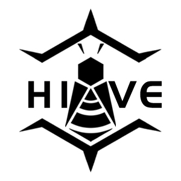
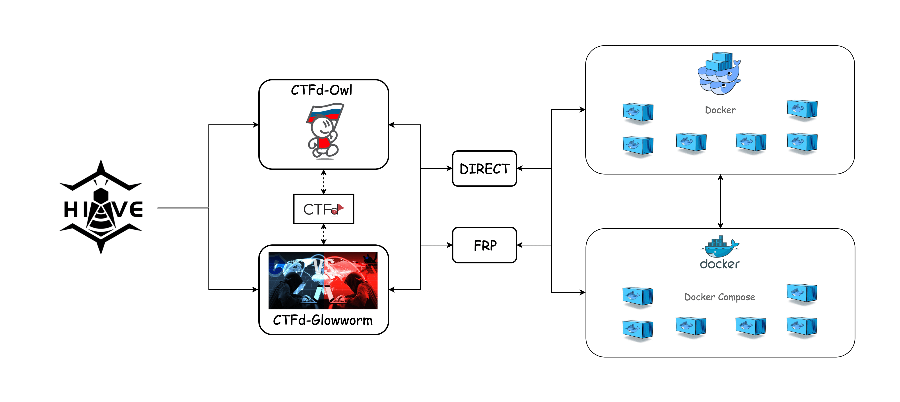

# ADCP 攻防实验平台



---

[](https://github.com/200okhhhhhh/ADCP_TYUT/issues) []() []() []()

## 项目简介

**ADCP（Attack & Defense Competition Platform）** 是为太原理工大学攻防实验室定制开发的一体化攻防竞赛与训练平台，支持解题赛（Jeopardy）、攻防对抗赛（AWD）等多种竞赛模式，适用于网络安全教学、实训和竞赛。

平台集成了容器化部署、动态Flag、自动评分、可视化战况等功能，助力高校网络安全人才培养。

---

## 主要功能与特色
- 支持解题赛（Jeopardy）与攻防对抗赛（AWD）多种模式
- 一键部署，自动化环境搭建
- 题目容器隔离，动态Flag防作弊
- 实时可视化战况与排行榜
- 插件化扩展，便于二次开发
- 适配教学、训练、校内外竞赛多场景

---

## 快速开始

```bash
git clone https://github.com/200okhhhhhh/ADCP_TYUT.git
cd ADCP_TYUT
```

### 单机模式（推荐）

```bash
docker-compose -f single.yml up
```

### 单机-Nginx模式

```bash
docker-compose -f single-nginx.yml up
```

---

## 平台架构



---

## 适用场景与愿景

ADCP 平台专为太原理工大学攻防实验室设计，旨在为网络安全教学、攻防训练、校内外竞赛提供一站式解决方案。平台已在多次校内外攻防演练、CTF 训练赛中应用，获得良好反馈。

我们希望通过 ADCP，降低攻防竞赛的组织与参赛门槛，提升学生实战能力，助力网络安全人才培养。

---

## 贡献与反馈

欢迎提出建议和反馈，或提交 Issue 参与平台共建。

---

## 开源声明

本项目遵循 [Apache License 2.0](https://github.com/200okhhhhhh/ADCP_TYUT/blob/main/LICENSE) 开源许可。

仅限学术、教学、公益用途，禁止未经许可的商业化使用及恶意更换平台标识。

如有疑问请联系项目维护者。